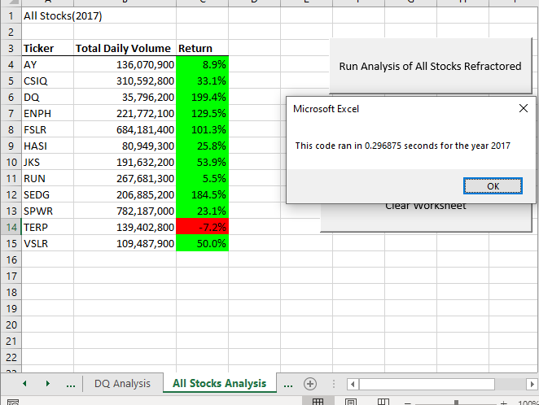
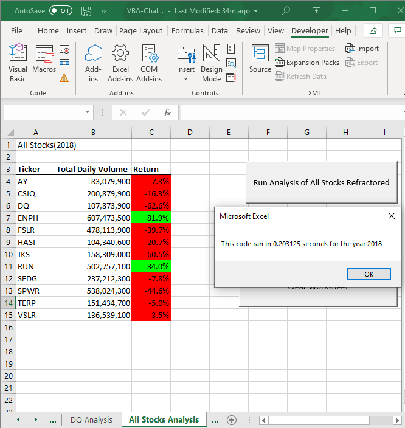

# Stock-Analysis

## **Overview of Project**
In this stock analysis we were asked to help Steve helping his parents in help invest in green energy. With the data that we downloaded we are using **Visual Basics for Application** also known as **VBA** to automate tasks that are considered tedious and time consuming. In this project we were writing code to extract information from the data sheet of a particular year and create a table that is easy to read and shows us all the information we need to give the correct analysis. Also, we learned how to take out code that we have written and learn to tweak it so it runs more effectively and efficiently.

## **Results**
After using VBA and creating the Macro you can see the results from the data and which green stocks look promising. Steve's parents wanted to invest their money into the stock DQ. The stock performed very well in 2017 showing a return of 199.4%. However, in 2018 it showed there was a major drop of 62.6%. Based on the information that we have from the green stocks the best investment would be ENPH; which has showed increase both in 2017 and 2018, 129.5% and 81.9% respectively. Refactoring the code cut the time it took the macro to run. With the original Macro that I had running 1.2 seconds and having to run another macro to get the formatting set. The Refactored Macro that I ran took under .3 seconds. 

## **Summary**
1. What are the advantages and disadvantages of refactoring code?
  - Some of the advantages of refactoring code is it makes the code much quicker. Sometimes, when you start writing code you are writing as one step at a time and this leads the code to be either superlong or tedious. However, when you refractor the code it can make it look a lot cleaner and can run more efficiently. Also, it allows you to learn better ways to apply a code and the next time it will be easier for you to create the code because you know what works and what does not.
  - With advantages also comes some disadvantages. One disadvantage is if another developer sees your code, they may not know what you are doing. This can be fixed by creating notes that other developers can see in your code and help them, but this is not a 100% guarantee. Also, going back in the code and changing certain sections may require you to spend time debug the code because one section may clash with another or for one to work another part may need to change also.
2. How do these pros and cons apply to refactoring the original VBA script.
- Refactoring the original VBA led to less time it took to pull the data and format it. The original VBA was split into two parts one pulled all the data the second would do the file formatting. With the refactored VBA it all did it in one shot and cut the time more than half. Then, it made the code easier to read and follow there was no going back and forth to see if something up top was missing or conflicted with something new you wrote. However, this also led to a lot of debugging issues with the script being more meticulous than broad; you had to make sure that everything was running correctly. Also, you had to make sure that your formulas are correct because one small issue would lead the macro not giving you the correct output. Also, without notes on what I was doing I got lost and had to retrace what I already did.
